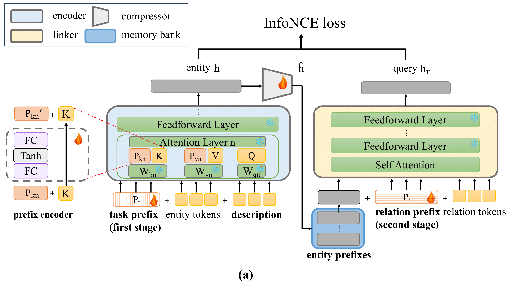

# Bi-Link
The code for Bi-Stage Prefix Tuning framework will be updated in this repo. The framework involves two Prefix-Tuning stages for inference speedup of knowledge graph reasoning.
In the first Prefix-Tuning stage, we apply vanillar Prefix-Tuning to obtain entity prefixes (representations). In the second stage, another round of Prefix-Tuning learns a group of relation prefixes to predict tail entities. Both stages are tuned with contrastive loss.
<figure>

    <figcaption style="text-align: center">Fig. 1 Bi-stage Prefix-Tuning of KG reasoning.</figcaption>
</figure>

<figure>

    <figcaption style="text-align: center">Fig. 2 Inference stage of Bi-Link.</figcaption>
</figure>
## Data Preparation
Extract knowledge graphs to the data folder similar as follows:
```python
wiki5m_ind
├── train.txt
├── valid.txt
├── test.txt
├── wikidata5m_entity.txt
├── wikidata5m_relation.txt
└── wikidata5m_text.txt 
```
## Prepare Environment
pip install -r requirement.txt

## Data Preprocessing
```bash
bash scripts/preprocess.sh wiki5m_ind
```
## Train
To train a Bi-Link BERT, please run
```bash
bash scripts/train.sh 
```
## Evaluation
To evaluate the model, please run
```bash
bash scripts/eval.sh
```
## Checkpoints
| Datasets                                                                                                                                                             | Checkpoints                                                          |
|-------------------------|----------------------------------------------------------------------|
| WN18RR                  | [Checkpoint](https://mega.nz/folder/8HMw2KJR#iGgjtjyd0CX92rKs656P5g) |
| Wikidata5M-transductive | [Checkpoint](https://mega.nz/folder/ob8mXYoL#1YXiUlX8RI7NZdrAnvypdA) |

