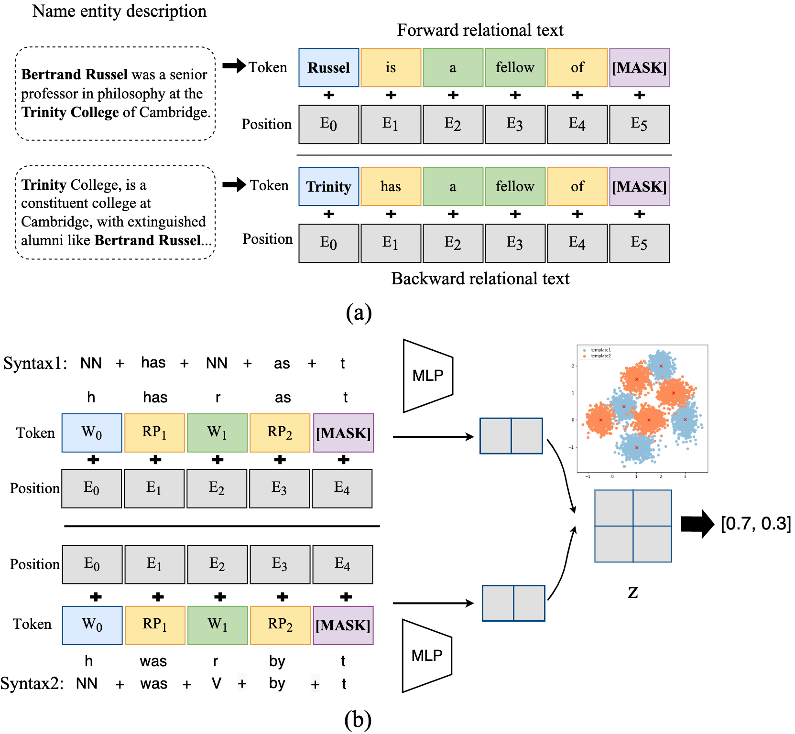

# Bi-link

This repository contains the code and [data](./data) of Bi-link and Zeroshot Entity Linking for Fandomwiki.

## Overview
We propose Bi-Link, a contrastive learning framework with probabilistic syntax prompts for link predictions. Using grammatical knowledge of BERT, we efficiently search for relational prompts according to learnt syntactic patterns that generalize to large knowledge graphs. To better express symmetric relations, we design a symmetric link prediction model, establishing bidirectional linking between forward prediction and backward prediction. This bidirectional linking accommodates flexible self-ensemble strategies at test time. In our experiments, Bi-Link outperforms recent baselines on link prediction datasets (WN18RR, FB15K-237, and Wikidata5M).

*** **UPDATE** ***

We are now merging Bi-link and Zeroshot Entity Linking for Fandomwiki to the current repository. We also upload our zeroshot fandomwiki dataset.

## Data
* Knowledge graphs and hierarchical templates are in the data folder.
* Fandomwiki dataset is available [here](https://www.dropbox.com/s/mfpefkux095n437/fandomwiki_data.zip?dl=0)

## Methods

Bi-link (Pytorch): 

* Bidirectional Contrastive Learning  with Syntax Prompts for Link Prediction

Zeroshot Entity Linking on Fandomwiki (PyTorch): 

* Bi-encoders for entity linking via contrastive learning
* NSP: Next Sentence Prediction


## Experimental Settings
*  Bi-link

In Bi-link we first train a probabilistic syntax prompt searching model for relation data (triples) of knowledge graphs. With these syntax, we link the triples into a sentence and use pretrained language models (PLMs) for link prediction.

*  Zeroshot Entity Linking on Fandomwiki

We first use tf-idf to retrieve top 64 candidate documents according to the mention in the entity description context. Then as for the cross-encoder baseline, which might be seen as a binary classification task, we treat the gold document as true label, and the rest of 63 documents as false label. As for the contrastive learning method, we treat the mention and reference documents as positive pairs, and the rest of 63 candidate documents as negative examples. Hyper-parameter tuning experiements are described in the submitted paper.

## Experiments
*  Bi-link

*  Zeroshot Entity Linking on Fandomwiki


## Quick Start

1. Install [PyTorch](https://pytorch.org/get-started/locally/)

2. Clone the master branch:
```bash
git clone -b master https://github.com/pengbohua/EntityLinkingForFandom/tree/master --depth 1
cd EntityLinkingForFandom
```

3. Prepare dataset for entity linking
```bash
cd entity_linking
unzip fandomwiki_data.zip
```

4. Quick Start
* For NSP Zeroshot Entity Linking on Fandomwiki
```bash
cd entity_linking
bash run_nsp.sh
```

* For CL Zeroshot Entity Linking on Fandomwiki
```bash
cd entity_linking
bash run_cl.sh
```

* For Bi-link
```bash
cd bi-link
bash eval.sh
```

## Data for entity linking on fandomwiki
The whole dataset contains three directories。
* documents: contains entities' documents on 16 fields in fandomwiki
* mentions: contains train.json, valid.json, test.json. Each json file describes the information about an entity linked to the mention in another entity's description.
* tfidf_candidates: contains train_tfidfs.json, valid_tfidfs.json, test_tfidfs.json. Eash json file contains a given entity mention and its tf-idf top 64 retrieved results.


