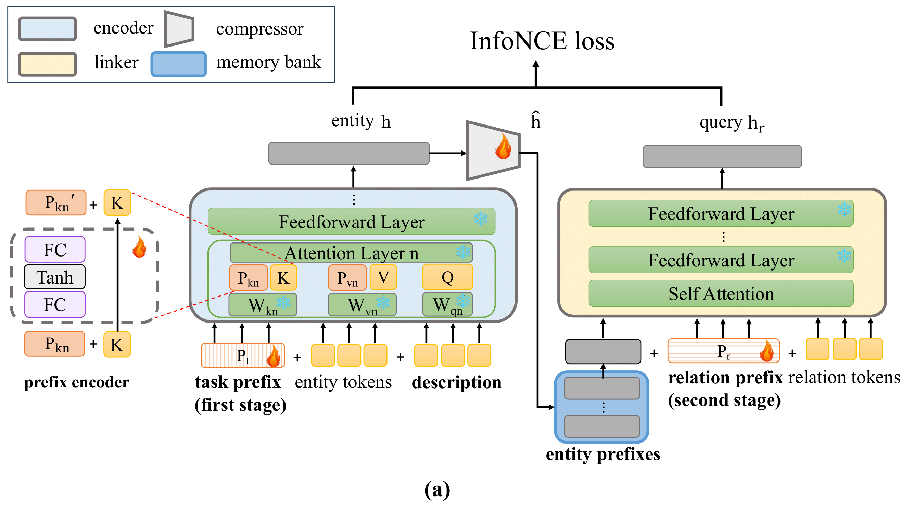
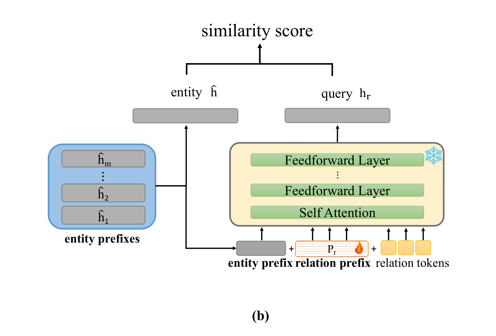
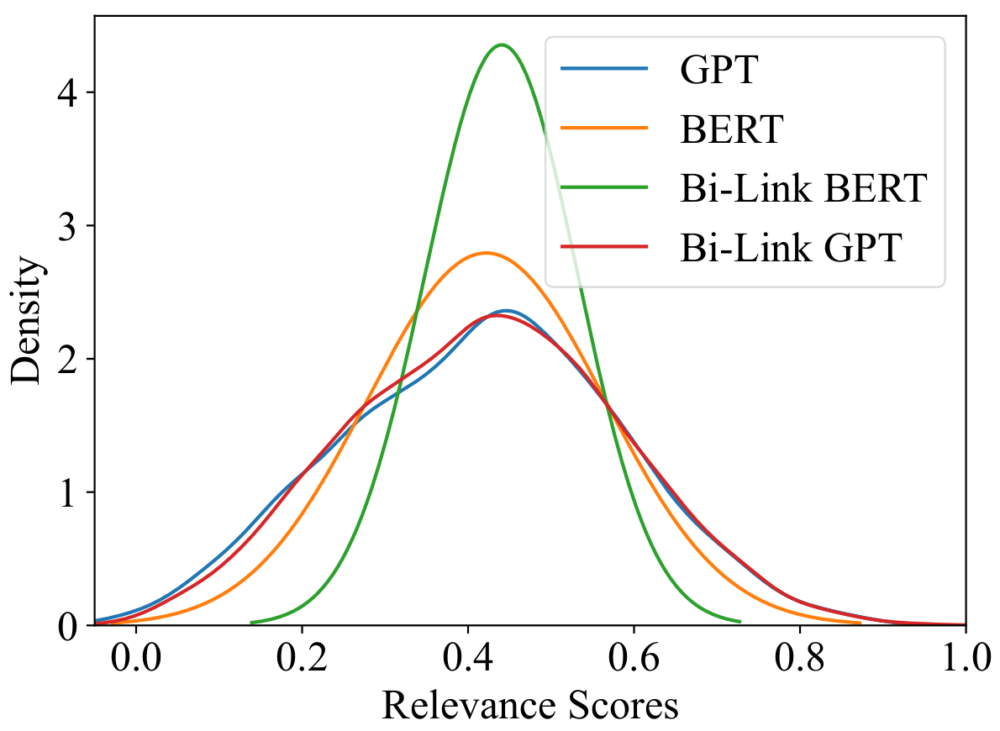

# Bi-Link
The code for Bi-Stage Prefix Tuning framework will be updated in this repo. The framework involves two Prefix-Tuning stages for inference speedup of knowledge graph reasoning.
In the first Prefix-Tuning stage, we apply vanillar Prefix-Tuning to obtain entity prefixes (representations). In the second stage, another round of Prefix-Tuning learns a group of relation prefixes to predict tail entities. Both stages are tuned with contrastive loss.
<figure>

    <figcaption style="text-align: center">Fig. 1 Bi-stage Prefix-Tuning of KG reasoning.</figcaption>
</figure>

<figure>

    <figcaption style="text-align: center">Fig. 2 Inference stage of Bi-Link.</figcaption>
</figure>

## Please Check Our Revised Paper
[Rethinking Knowledge Graph Reasoning via Bi-stage Tuning for Inference Speedup and Antiphrasis Evaluation](./revised_manuscript.pdf)
## Download all files within the repo
```bash
unzip all_files.zip -d DESTINATION
```

## Data Preparation
Extract knowledge graphs to the data folder similar as follows:
```python
wiki5m_ind
├── train.txt
├── valid.txt
├── test.txt
├── wikidata5m_entity.txt
├── wikidata5m_relation.txt
└── wikidata5m_text.txt 
```

## Prepare Environment
pip install -r requirement.txt

## Data Preprocessing
```bash
bash scripts/preprocess.sh WN18RR
```
## Train
To train a Bi-Link BERT, please run
```bash
OUTPUT_DIR=./checkpoint/wn18rr/ DATA_DIR=./data/WN18RR bash scripts/train_wn.sh
```
## Checkpoints
| Dataset                 | Checkpoints                                                          |
|-------------------------|----------------------------------------------------------------------|
| WN18RR Bi-Link BERT     | [Checkpoint](https://mega.nz/file/1W0yVLTY#1zOuDVhYyplCvZp5AOQTGey7dCiSqA0FnKepPmVGupg)|
| Wikidata5M-transductive | [Checkpoint](https://mega.nz/folder/ob8mXYoL#1YXiUlX8RI7NZdrAnvypdA) |

```bash
mv ${CHECKPOINT_BI-LINK_WN18RR} checkpoints/bilink_bert
```
## Evaluation
To evaluate the model, please run
```bash
bash scripts/eval_wiki5m_ind.sh ${CHECKPOINT} WN18RR
```

## Model Comparison
<figure>

    <figcaption style="text-align: center">Fig. 3 Comparison between wrongly predicted tails' relevance scores with labels.</figcaption>
</figure>


